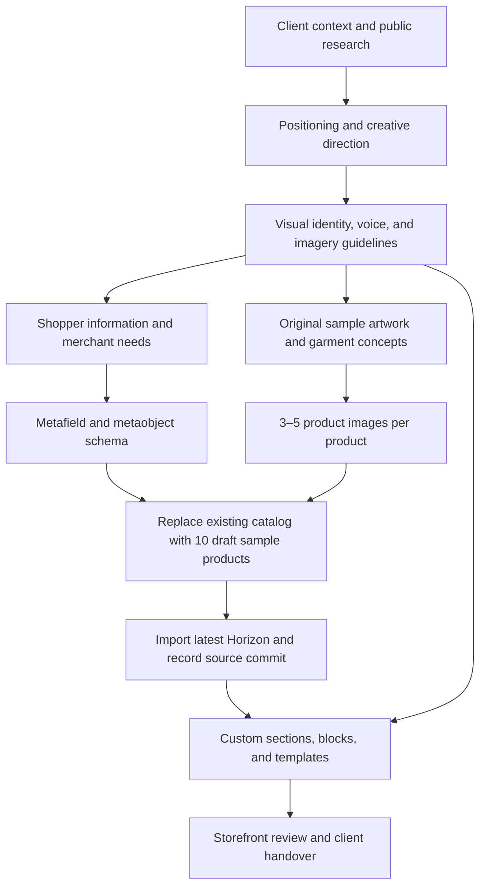

# TCPF Basics — phase dependencies

Updated: 2026-10-05. This describes the agreed project order, not a completed implementation.

Ready-to-wear shopping is the primary journey. Bespoke commissions are a secondary offer. The selected direction is Contemporary Wearable Gallery, retaining the existing logo. Brand decisions determine both the information architecture and the visual treatment of the storefront.

The user authorized replacing existing products because they carry borrowed imagery. Phase 2 will preserve reference prices, generate fresh sample assets, and replace the catalog. Samples remain drafts while their concepts are reviewed; generated paintings are not attributed to Tisha Chavez.

See the [project brief](../project-brief.md) for deliverables and current observations.
