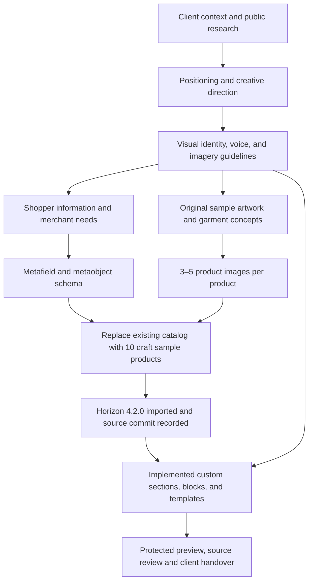

# TCPF Basics — phase dependencies

Updated: 2026-10-05. Brand, sample catalog and custom Horizon source are implemented; protected preview observations and final source review are complete; client launch approval remains pending.

Ready-to-wear shopping is the primary journey. Bespoke commissions are a secondary offer. The selected direction is Contemporary Wearable Gallery, retaining the existing logo. Brand decisions determine both the information architecture and the visual treatment of the storefront.

The user authorized replacing existing products because they carry borrowed imagery. Phase 2 preserved reference prices, generated fresh sample assets, and replaced the catalog. Samples started as drafts and are now active for the authorized protected demonstration only. They remain concept flagged at tracked zero stock/DENY; generated paintings are not attributed to Tisha Chavez.

See the [project brief](../project-brief.md) for deliverables and current observations.
