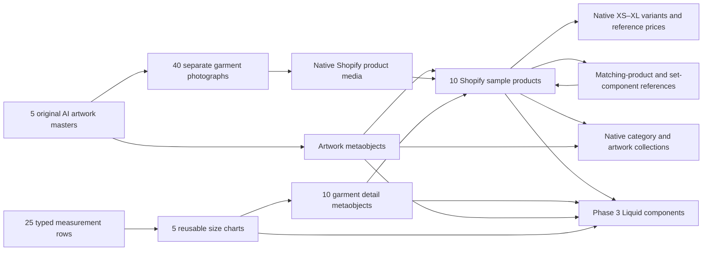
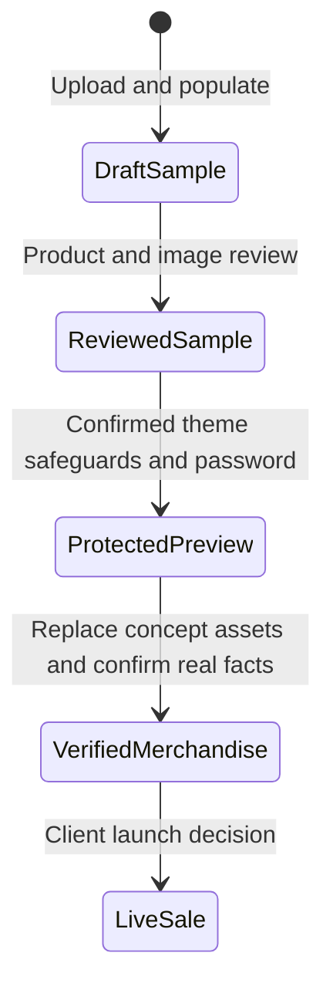
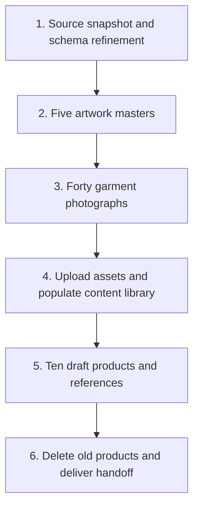

# TCPF Shopify data relationships

2026-10-05 · Phase 2 schema and sample catalog implemented; phase 3 entries/products are active only for the protected demonstration.

Samples retain zero tracked inventory, DENY overselling, and the concept flag. After confirmed password protection and source guards, the user-authorized phase 3 demonstration activated the required data and published products/collections only to Online Store. A reviewed AI sample is not automatically verified merchandise.

## Phase 2 execution dependencies

Each dependent mutation waits for its referenced files or records to be ready. Independent artwork families can generate in parallel. Individually accepted uploads and independent measurement records may stage while later photographs render; all forty photos and five masters must be ready before task 4 completes. Shared dependent store writes remain ordered.

Shopify Files hosts the 45 catalog images consumed above. The connected Git branch retains asset IDs, CDN mappings and provenance; PNG originals stay in ignored local paths and a separate archive. See [asset storage and recovery](../../data/catalog/README.md) for the preserved source revision and checksum procedure.

See the [phase 2 design](../specs/2026-10-05-shopify-data-catalog-design.md) and [implementation plan](../plans/2026-10-05-shopify-data-catalog.md).

## Phase 3 consumers

The implemented theme reads these typed references into artwork stories, garment facts, ordered size tables, set contents, and context-labeled recommendations. It shares the concept flag across product/card/search/cart/structured-data paths. The [theme architecture](shopify-theme-architecture.md) shows the native Horizon interfaces and protected-preview handoff; the [theme specification](../specs/2026-10-05-shopify-theme-design.md) records the shop-first composition.
