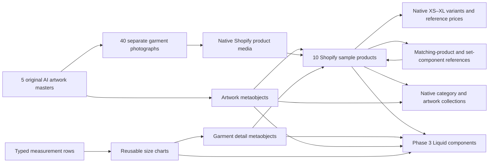
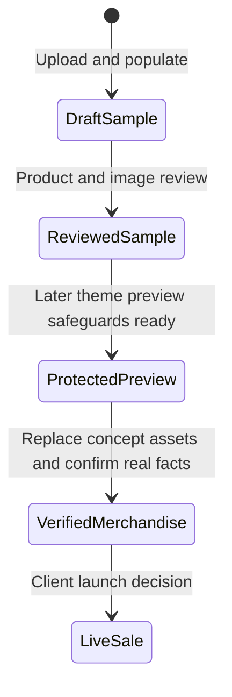
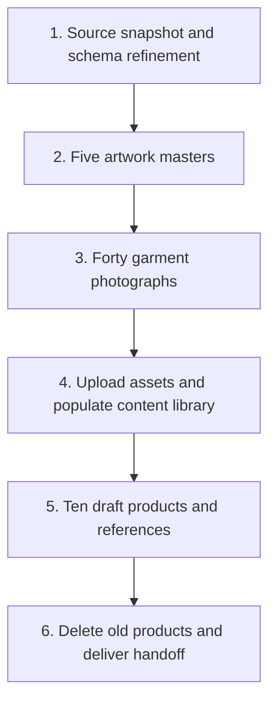

# TCPF Shopify data relationships

2026-10-05 · Phase 2 approved design; definitions have not yet been changed.

Draft samples have zero inventory, deny overselling, and carry the concept flag. Normal collections cannot render draft products, so preview publication is a separate phase 3 handoff after password protection and sample purchase guards are confirmed. A reviewed AI sample is not automatically verified merchandise.

## Phase 2 execution dependencies

Each dependent mutation waits for its referenced files or records to be ready. Independent artwork families can generate in parallel. Individually accepted uploads and independent measurement records may stage while later photographs render; all forty photos and five masters must be ready before task 4 completes. Shared dependent store writes remain ordered.

See the [phase 2 design](../specs/2026-10-05-shopify-data-catalog-design.md) and [implementation plan](../plans/2026-10-05-shopify-data-catalog.md).
