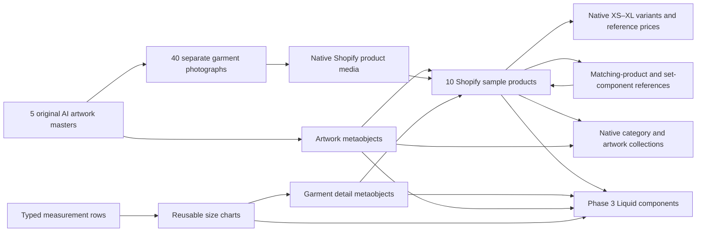
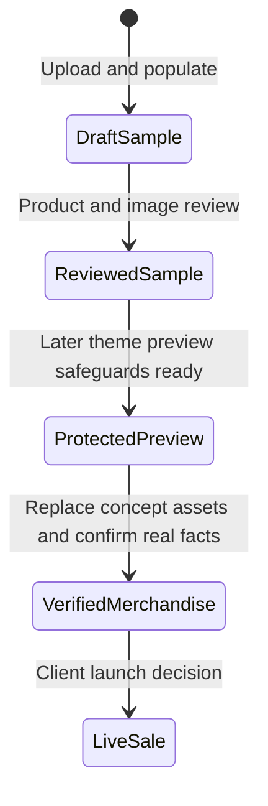

# TCPF Shopify data relationships

2026-10-05 · Phase 2 proposed design; definitions have not yet been changed.

Draft samples have zero inventory, deny overselling, and carry the concept flag. Normal collections cannot render draft products, so preview publication is a separate phase 3 handoff after password protection and sample purchase guards are confirmed. A reviewed AI sample is not automatically verified merchandise.

See the [phase 2 design](../specs/2026-10-05-shopify-data-catalog-design.md).
