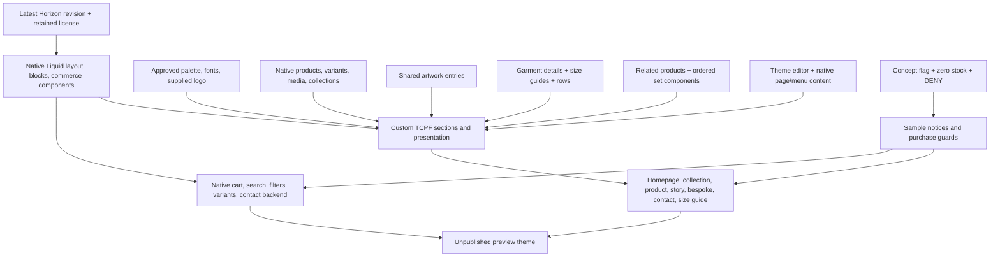
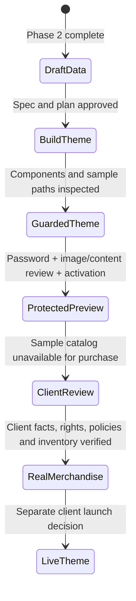

# TCPF Basics — theme architecture

2026-10-05 · Proposed phase 3 design. Theme source has not yet been imported into the project.

The sample guard covers product/card/featured/recommendation/search/cart/structured-data paths. It is accompanied by store inventory safeguards; it is not a server-side checkout extension. Existing themes and uncertain old Files remain separate from the fresh-Horizon build.

See the [theme specification](../specs/2026-10-05-shopify-theme-design.md) and [data architecture](shopify-data-model.md).
