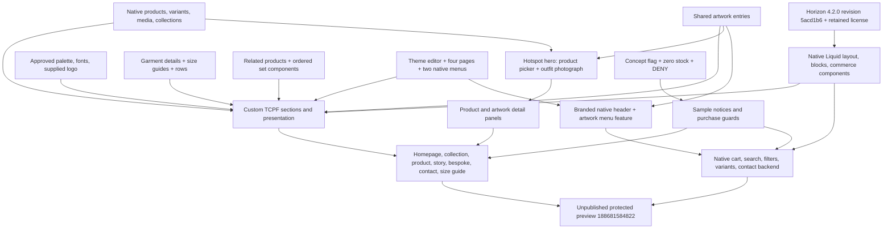
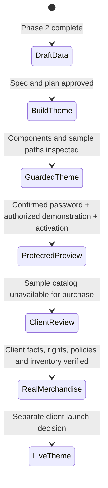

# TCPF Basics — theme architecture

2026-10-05 · Implemented phase 3 architecture. Horizon 4.2.0 and custom source are in the project; protected preview 188681584822 is uploaded.

The sample guard covers product/card/featured/recommendation/search/cart/structured-data paths. It is accompanied by store inventory safeguards; it is not a server-side checkout extension. Existing themes and uncertain old Files remain separate from the fresh-Horizon build.

See the [theme specification](../specs/2026-10-05-shopify-theme-design.md) and [data architecture](shopify-data-model.md).

Homepage/header revision: approved in conversation on 2026-10-05 and uploaded to separate unpublished preview **188685779126**. The hero reads `product.metafields.tcpf.design_concept`; the menu feature reads the selected collection's `tcpf.artworks`. Both reuse the hosted catalog images. Hotspot JavaScript progressively enhances server-rendered detail cards and cleans up its event listeners when a section is replaced in the editor. No schema migration is required.

Current preview state: ten active concepts, 45 active entries, eight Online Store collections; tracked zero stock and DENY; client artwork approval pending. Size-guide picker selections use handles in their declared type, while API state records GIDs. All planned page views and final source review are recorded in [build evidence](../theme/05-build-report.md). Client launch remains pending.
